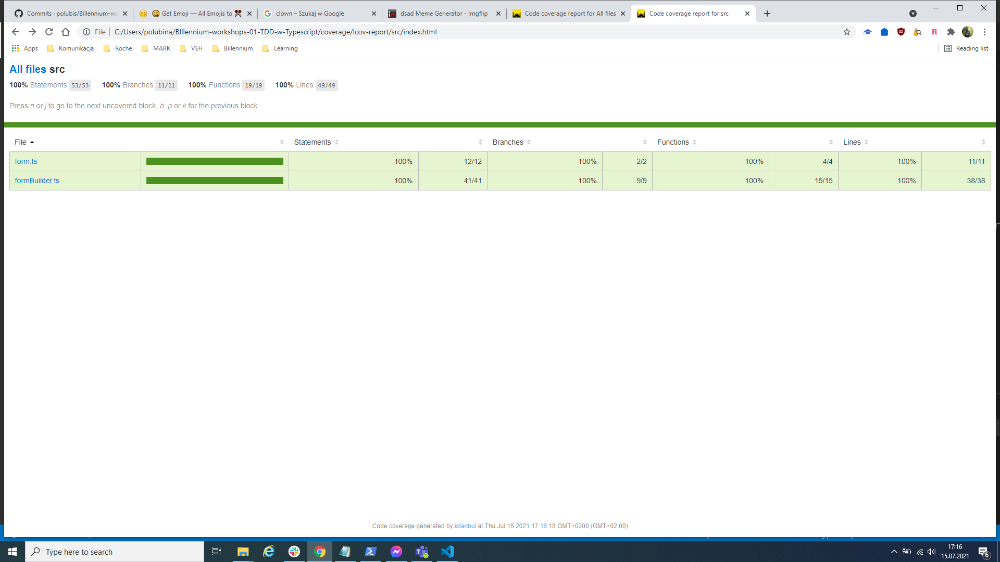

# Billennium-workshops-01-TDD-w-Typescript

### Jak uruchomić ?

`git clone https://github.com/polubis/Billennium-workshops-01-TDD-w-Typescript.git`

`cd Billennium-workshops-01-TDD-w-Typescript`

`code .`

`npm install`

`npm run test-watch`

### Motto przewodnie

"Testów przydatności dowieść może tylko człek, który tablice bugów z regresji posiada."


### Co dają testy ?

- Większą odporność na regresje.
- Łatwiejszy refactor.
- Ułatwiają utrzymanie aplikacji.
- Wprowadzają dokumentację do kodu.

### Nie idź ślepo w code coverage

Fajnie jak masz 100% pokrycia kodu testami, ale dobrze jest jak masz i 10%. Ważne, aby na samym początku testować znaczące fragmenty twojego systemu / apki / biblioteki.



### Konsekwencje pisania testów

- Musimy je naprawiać.
- Aktualizujemy zależności związane z testowaniem.
- Zwiększamy próg wejścia w projekt.
- Dodatkowo dbamy o kod testów.
- Dodatkowy kod do review podczas `PR`.

### Piramida testów


### TDD

Podejście do pisania testów, w którym kolejno:

- Tworzymy kontrakt tego co chcemy testować.

```ts
// TAK
const sum = (a: number, b: number) => {};
// LUB TAK WEDŁUG SZTUKI
const sum = (a: number, b: number): number => {
  throw new Error('Not implemented');
};
```

- Najpierw piszemy opis testu.

```ts
it('adds 2 numbers', () => {
  ///...
});
```

- Potem dodajemy jego implementację.

```ts
// Testy w tym momencie nie przechodzą
it('adds 2 numbers', () => {
  expect(sum(2, 4)).toBe(6);
});
```

- Następnie dodajemy implementacje, która sprawia, że test przechodzi.

```ts
const sum = (a: number, b: number): number => {
  return a + b;
};
```

- Robimy refactor kodu.

```ts
const sum = (a: number, b: number): number => a + b;
```

### Kiedy warto używać ?

- Projekty startujące.
- Nowe funkcjonalności.
- Kiedy kod jest testowalny.

> "Testowalność kodu" to nie wartość tak/nie tylko metryka. Kod jest "testowalny" w jakimś stopniu, a nie "testowalny", albo nie "testowalny".

- Stabliny proces definiowania zakresu funkcjonalności.

> Tutaj mogą się przydać `scenariusze testowe` od testera manualnego bądź dobrze opisane `user stories`.

### Jakie problemy może rozwiązać TDD ?

- Redukuje problemy z regresją.
- Bardziej przemyślany kod - pokrywa więcej przypadków brzegowych.
- `Check lista` tego co zostało zrobione, a co nie.

### Jakie problemy może spowodować ?

- Spowolnić development gdy podejście jest nie wystarczająco przećwiczone.

> TDD przu użyciu typescript z opcja `strict` na `true` może być ciężkie. `jest` pokaże testy jako failujące nawet jeżeli implemnetacja logiki będzie poprawna. Dlatego też często podczas używania TDD z `ts` rzutuje się na `any` w celu "uspokojenia" kompilatora `ts` i możliwości testowania czegoś w izolacji. Na sam koniec wyrównuje się typy do docelowych.

## Kiedy tworzymy biblioteki ?

Biblioteki tworzymy gdy chcemy:

- Współdzielić kod między aplikacjami/bibliotekami.
- Zwiększyć performance (fe) - takie bibiolteki można wrzucić w cache na wieki.
- Sprawić, aby rozwiązanie było reużywalne.
- Zwiększyć enkapsulację i uniemożliwić modyfikowanie kodu.
- Uspójnić kod systemu.
- Zainwestować nas czas na przyszłość. Takie biblioteki mogą być używane w nowych projektach.

### Dlaczego biblioteka od formularzy ?

Ponieważ zarządzanie warstwą walidacji po stronie be/fe oraz pomiędzy różnymi frameworkami fe różni się na tyle, że nie można współdzielić kodu. Jesteśmy niezależni pod tym względem od technologii.

Przyjmeny model obsługi pól formularzy prezentuje `Angular` i `FormControl`. Będzie to naszą inspiracją jednak zmienimy kilka rzeczy.

#### Przykład formularza w React (Yup, Formik)

```ts
// VALIDATION SCHEMA
const SignupSchema = Yup.object().shape({
  firstName: Yup.string().min(2, 'Too Short!').max(50, 'Too Long!').required('Required'),
  lastName: Yup.string().min(2, 'Too Short!').max(50, 'Too Long!').required('Required'),
  email: Yup.string().email('Invalid email').required('Required'),
});

// COMPONENT AND USAGE
export const ValidationSchemaExample = () => (
  <div>
    <h1>Signup</h1>
    <Formik
      initialValues={{
        firstName: '',
        lastName: '',
        email: '',
      }}
      validationSchema={SignupSchema}
      onSubmit={(values) => {}}
    >
      {({ errors, touched }) => (
        <Form>
          <Field name="firstName" />
          {errors.firstName && touched.firstName ? <div>{errors.firstName}</div> : null}
          <Field name="lastName" />
          {errors.lastName && touched.lastName ? <div>{errors.lastName}</div> : null}
          <Field name="email" type="email" />
          {errors.email && touched.email ? <div>{errors.email}</div> : null}
          <button type="submit">Submit</button>
        </Form>
      )}
    </Formik>
  </div>
);
```

#### Przykład formularza w Angular (ReactiveForms)

```ts
export class ProfileEditorComponent {
  profileForm = new FormGroup({
    firstName: new FormControl('', Validators.required),
    lastName: new FormControl(''),
    address: new FormGroup({
      street: new FormControl(''),
      city: new FormControl(''),
      state: new FormControl(''),
      zip: new FormControl(''),
    }),
  });
}
```

```html
<form [formGroup]="profileForm">
  <label for="first-name">First Name: </label>
  <input id="first-name" type="text" formControlName="firstName" />

  <label for="last-name">Last Name: </label>
  <input id="last-name" type="text" formControlName="lastName" />
</form>

<button type="submit" [disabled]="!profileForm.valid || profileForm.pristine">Submit</button>
```

### Przykład walidacji w NodeJS - jawne sprawdzanie url

```ts
ScraperController.get('/', async (req: Request, res: Response, next: NextFunction) => {
  try {
    const userFormData: UserFormData = req.body as UserFormData;

    if (!userFormData.username || userFormData.!phone) {
      next(new BadRequest('Url parameter is required'));
    }

    const result = await ScraperService.scrapUrl(req.query.url as string);

    parseSuccess(result, res);
  } catch (err) {
    next(new BadRequest(err));
  }
});
```

### Zanim zaczniemy implementacje

Musimy spisać założenia oraz stworzyć prototyp API.

#### Założenia

- **100% typesafe** - raz przekazane wartości mają później zawsze ten sam typ.
- **cohesion** - biblioteka po każdej zmianie wartości zwraca dokładnie to samo API.
- **standalone** - biblioteka jest całkowicie standalone.
- **low boilerplate** - jak najmniej kodu, ale nie kosztem rozumienia API.
- **100% immutable** - kompatybilność z frameworkami fe oraz łatwość debugowania.
- **customizable** - algorytmy walidujące możliwe do dostosowania.

#### Model oraz prototyp API

```ts
// Pseudo kod pokazujący sposób działania.
import { form } from 'form';
import { req, min, max, minLength, maxLength } from 'validators';

const loginForm = form(
  {
    username: '',
    password: '',
  },
  { username: [req, min(2), max(10), minLength(20), maxLength(30)] },
);

loginForm.set({ username: 'd' }); // częściowy update. Modyfikacja tylko propki username
loginForm.set({ username: 1 }); // TS ERROR invalid type

loginForm.next(); // to samo co set, ale robi kopie

// React
this.setState((prevState) => ({
  loginForm: prevState.loginForm.next({
    username: e.target.value,
  }),
}));
```

## Implementacja biblioteki

Można prześledzić sobie historię zmian i porównywać z opisami tutaj.

### (1 Commit) Initial commit

Stworzenie solucji. Nie istotny z punktu widzenia nauki TDD.

### (2 Commit) Add project structure and test configuration

Setup projektu i instalacja zależności. Linter, code formatter, typescript oraz framework do testowania `jest`.

### (3 commit) Write test scenarios and add basic models

1. Stworzeno boilerplate testowy - według konwencji z samego początku.
2. Dodano testy, które failują.
3. Dodano podstawowe modele, aby zachować spójność API i spokój `ts`. 👽


### (4 commit) Write values shape validator

1. Doprecyzowanie typów.
2. Zakomentowanie reszty testów w celu ułatwienia developmentu.
3. Testy + implementacja walidacji początkowych wartości.

### (5 commit) Finish whole initialization of form

1. Implementacja testów do sprawdzenia poprawnej inicjalizacji.
2. Implementacja logiki, aby testy przechodziły.
3. Dalsze doprecyzowanie typów.

### (6 commit) Refactor current tests to be more intuitive and more scalable

1. Refactor mocków - wprowadzenie wzorca `builder` do tworzenia mocków użytkownika.

### (7 commit) Add tests suites for set() and next()

1. Dodanie opisów do testów.
2. Doprecyzowanie typów dla metod `set()` oraz `next()`.

### (8 commit) Implement tests and implementation for set(), next() methods

1. Napisanie logiki testów.
2. Dopisanie implementacji, która sprawia, że testy przechodzą.
3. Doprecyzowanie typów.

### (9 commit) Compare tests helper functions with typical approach

1. Redukcja kodu testów za pomocą pomocniczych funkcji testujących.

### (10 commit) Write failing tests for submit(), check() methods and add implementation

1. Dopisanie failujących testów do metod `submit()` oraz `check()`.
2. Doprecyzowanie typów.
3. Dodanie implementacji.
4. Refactor kodu.

### (11 commit) Add option to apply other check result algorythms

1. Używamy wzorca `IOC - inversion of control` i przekazujemy funkcję, która będzie tworzyć rezultat walidacji.
2. Dostosowujemy kod mając ciągle uruchomione testy. Z prespektywy funkcjonalności nic się nie zmienia. Poprostu `hard coded` algorytm zostanie teraz przekazany poprzez paremetry.
3. Tworzymy oraz dostosowujemy modele.

### (12 commit) Add option to apply generic value for errors object

1. Zmieniamy definicję typów w taki sposób, aby typ rezultatu w obiekcie `errors` mógłbyć określony podczas budowania mechnizmu obsługi formularza.
2. Implementacja wzorca `builder` do budowy modułu od obsługi formularza.

### (13 commit) Add React facade POC

```tsx
// React facade tests POC
import { renderHook } from '@testing-library/react-hooks';
import { useForm } from './useForm';

import { form } from 'io-form';

// Mockujemy cały moduł. Nie zwracamy uwagi czy działa poprawnie czy nie.
// Interesuje nas tylko proces komunikacji pomiędzy API React, API biblioteki.
jest.mock('io-form', () => ({
  form: () => ({
    next: () => {},
    submit: () => {},
  }),
}));

describe('useForm()', () => {
  describe('handleChange()', () => {
    it('updates form state via form API', () => {
      const { result } = renderHook(() => Form.useManager(_CONFIG_));

      act(() => {
        result[1]({});
      });

      expect(form.next).toHaveBeenCalled();
    });
  });

  afterEach(() => {
    jest.clearAllMocks();
  });
});
```

```tsx
// React facade POC.
// Pamiętaj, że to tylko propozycja, a nie prawdziwa implementacja.
import { form, Form, Dictionary } from 'io-form';

const useForm = <V extends Dictionary, R = boolean>(initValues: V, fns?: Fns<V, R>): [] => {
  const [formState, setFormState] = useState(form(initValues, fns));

  const handleChange = useCallback((e: React.ChangeEvent<HTMLInputElement>): void => {
    // Support for lower than 17.0 synthetic event performance improvements
    const name = e.target.name;
    const value = e.target.value;

    setFormState((prevFormState) =>
      prevFormState.next({
        [name]: value,
      }),
    );
  }, []);

  const handleSubmit = useCallback((e: React.FormEvent<HTMLFormElement>): void => {
    setFormState((prevFormState) => prevFormState.submit(e));
  }, []);

  const { ...formData, set, next, check, submit } = formState;

  return [formData, handleChange, handleSubmit];
};

// React facade usage in dedicated form
import React, { useState, FC } from 'react';
import { NavLink } from 'react-router-dom';

import { Button, InputField } from 'ui';

import { useForm } from 'io-form-react';
import { required, minLength, maxLength, min, max } from 'io-validators';

import csx from './UserForm.scss';

interface UserFormData {
  username: string;
  code: number | null;
  phone: string;
}

const initData = (): UserFormData => ({
  username: '',
  code: null,
  phone: '',
});

const VALIDATORS = {
  username: [required, minLength(8), maxLength(20)],
  code: [required, min(1000), max(9999)],
  phone: [required, minLength(9), maxLength(9)],
};

const UserForm: FC = () => {
  const [data, change, submit] = useForm(initData(), VALIDATORS);

  const handleSubmit = useCallback(
    (e: React.FormEvent<HTMLFormElement>) => {
      submit(e);
    },
    [values],
  );

  const { dirty, invalid, touched, values, errors } = data;

  return (
    <form onSubmit={handleSubmit}>
      <InputField
        data-key="username"
        label="Username"
        placeholder="Username..."
        error={touched ? (errors.username ? 'Invalid username format' : '') : ''}
        value={values.username}
        onChange={change}
      />

      <InputField
        data-key="code"
        label="Code"
        placeholder="xxxx"
        error={touched ? (errors.code ? 'Invalid code format' : '') : ''}
        value={values.phone}
        onChange={change}
      />

      <InputField
        data-key="phone"
        label="Phone"
        placeholder="xxx xxx xxx"
        error={touched ? (errors.phone ? 'Invalid phone format' : '') : ''}
        value={values.phone}
        onChange={change}
      />

      <Button type="submit" disabled={dirty && invalid}>
        SUBMIT
      </Button>
    </form>
  );
};

export default LoginForm;
```

### (Commit 14) Add Angular facade POC

```ts
// Angular io-form facade POC
// Pamiętaj, że to tylko propozycja, a nie prawdziwa implementacja.
import { Injectable } from '@angular/core';
import { BehaviourSubject } from 'rxjs';
import { map } from 'rxjs/operators';

import { form, Dictionary, Fns, Form, SubmitEvent } from 'io-form';

@Injectable()
class Form<V extends Dicitionary> {
  protected _form: Form<V>;
  data$: Observable<Form<V>>;

  config = (initValues: V, initFns: Fns<V, boolean>): void => {
    this._form = new BehaviourSubject(form<V>(initValues, initFns));
    data$ = this._form.asObservable().pipe(map(({ set, next, check, submit, ...data }) => data));
  };

  change = (e: Event): void => {
    this._data.next(
      this._data.getValue().next({
        [e.target.name]: e.target.value,
      }),
    );
  };

  submit = (e: SubmitEvent): void => {
    this._data.next(this._data.getValue().submit(e));
  };
}
```

```ts
interface UserFormData {
  username: string;
  code: null | number;
  phone: string;
}

@Component({
  template: `
    <form *ngIf="data$ | async as data">
      <input [value]="data.value" (input)="form.change($event)" />
    </form>
  `
})
class UserForm {
  this.data$ = this.form.data$;

  constructor(public form: Form<UserFormData>) {
    this.form.config({
      username: '',
      code: null,
      phone: ''
    });
  }
}
```

## Na koniec tipy

- Na początku przećwicz TDD na prostych funkcjach typu `sum()` aż podejście wejdzie Ci w krew.

- Unikaj tworzenia mocków "ręcznie". Oddeleguj ten proces do innego bytu. To jaki wzorzec implementuje nie ma znacznia. Chodzi tylko o spójność danych i redukcje niedozwolonych operacji na mockach.

```ts
// Don't do
const _USER_ = { id: 0 };
// Do
const _USER_ = userBuilder().valueOf();
```

- Nie używaj `magic numbers`, ani przy testach nie odnoś się do elementów tablicy. Zmiana kolejności może wyłożyć wiele testów.

```ts
// DON'T DO
const _USERS_ = [userBuilder.valueOf(), userBuilder.valueOf()];
// DO
const _VALID_USER_ = userBuilder.valueOf();
const _INVALID_USER_ = userBuilder.setUsername('').valueOf();
```

- Twórz funckje pomocnicze testujące potwarzalną logikę w module.

```ts
// DO - pamiętaj jednak, że to niesie za sobą ryzyko wywalenia testów jeżeli taka funkcja będzie źle zaimplementowana.
const testRefTypesExceptionThrow = (creator: (arg: any) => any): void => {
  expect(() => form([] as any)).toThrow();
  expect(() => form(() => '' as any)).toThrow();
};
```

## Przykład na żywo

## Podsumowanie

W artykule przeszliśmy przez proces budowy biblioteki do obsługi formularzy, warstwy ustawiania, walidacji dowolnego modelu.

Jest to prosty przykład ilustrujący proces "myślenia" podczas tworzenia kodu z wykorzystaniem TDD, a nie rozwiązanie produkcyjne gotowe do użycia.

## PS

Testowanie to tylko jedno z wielu narzędzi dbania o jakość naszych rozwiązań. Stosując je z pewnością zauważysz różnice. Jest to inwestycja, która zwraca się zawsze po czasie, tak samo jak `TypeScript`.


### Generic / typical teksty od ludzi, którzy nie lubią w testy


1. Nie mam czasu w projekcie na testy.
2. Pisanie w TDD wydłuża development.
3. Ogłoszenie z nofluffjobs ->

```ts
const developer = {
  tests: 'are you kidding ?',
};
```

4. W moim projekcie nie da się wdrożyć testów.
5. expect(true).toBe(true) XD 100% pokrycia XD.

## Następna prezentacja - Monorepo z Lerna - 4 apki (Angular, Vue, React, Gatsby)
