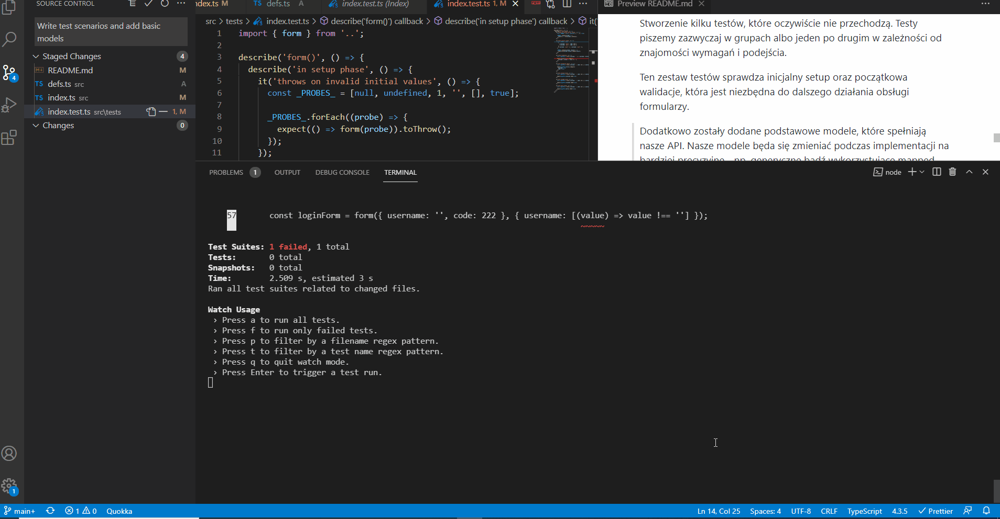

# Billennium-workshops-01-TDD-w-Typescript

## Czym jest test ?

Sprawdzenie naszego kodu w sposób manualny bądź automatyczny (uruchomienie go i porównanie otrzymanego wyniku z oczekiwanym).
My się skupimy na automatycznym testowaniu z wykorzystaniem
`jest`.

### Co dają testy ?

- Poczucie stabilności w projekcie jeżeli są dobrze napisane.
- Odporność na regresję.
- Łatwość robienia refactoru kodu.
- Ułatwiają utrzymanie aplikacji.
- Wprowadzają swoistą dokumentację do kodu.

### Piramida testów


Zazawyczaj piszemy najwięcej testów jednostkowych chociaż są projekty i podejścia w których stawia się na testy integracyjne.
One znacznie częściej failują, ale pilnują większej częsci funkcjonalności.

### Utrzymanie testów

Czyli koszt jaki ponosimy pisząc testy, naprawiając je, aktualizując biblitoteki, ucząć się potrzebnych technologii
oraz pilnując konwencji (tak w skrócie).

### TDD

Podejście w którym najpierw piszemy test, testy. Sprawiamy, aby te testy nie przechodziły, a następnie dopisujemy kod i uruchamiając testy sprawdzamy czy testy przechodzą.

```ts
// TAK NIE ROBIMY W TDD
const sum = (a: number, b: number): number => a + b;
it('adds 2 numbers', () => {
  expect(sum(2, 4)).toBe(6);
});

// TAK ROBIMY W TDD
it('adds 2 numbers', () => {
  expect(sum(2, 4)).toBe(6);
});
const sum = (a: number, b: number): never => {
  throw new Error('Not implemented');
};
// Uruchamiamy testy
// Test run failed
// Piszemy poprawną implementację
const sum = (a: number, b: number): number => a + b;
// Testy przechodzą
```

### Kiedy używać ?

- Dla mało doświadczonych devów tylko na testach jednostkowych.
- Dla całej reszty to już zależy od preferencji (ja piszę dla testów jednostkowych zawsze, dla integracyjnych tylko wtedy gdy testują logikę biznesową).
- Kiedy projekt ma stabilny proces planowania i dokumentowania funkcjonalności (jeżeli koncept jest często zmieniany to nie ma sensu wykorzystywać TDD), a nawet i często pisać testy.

### Jakie problemy może rozwiązać TDD ?

- W skrócie dobrze wykorzystywane TDD potrafi znacznie ograniczyć liczbę bugów związanych z warunkami brzegowymi.
- Kod staje się bardziej przemyślany ponieważ przed pisaniem tworzymy w pewien sposób scenariusz tego jak kod ma działać.
- Kod staje się bardziej odporny na regresję.
- Pozwala się łatwo odnaleźć w przypadku gdy ktoś skaczę z projektu na projekt i ma tendencję do zapominania tego co robił wczoraj czy kilka dni temu. Pozwalają robić coś w rodzaju ToDo listy pod konkretny task.

### Jakie problemy może spowodować ?

Wiadomo, że w programowaniu jak i w życiu nie ma nic za darmo i zawsze balansujemy pomiędzy wagami plusów i ich ilością, a minusów.

- Spory próg wejścia i problem z przestawieniem myślenia dla mniej doświadczonych devów.
- Dla osób rozpoczynających przygodę z tym podejściem często czas developmentu się znacznie wydłuża.
- Wymaga sporej wprawy.
- Wymaga umiejętności przestawiania się na to czy coś piszemy z wykorzystaniem TDD czy "tradycyjnie" najpierw implementacja, a później testy - poprostu czasami często jest wykorzystać TDD przy testowaniu integracyjnym.

## Po co tworzymy biblioteki ?

Wyobraźmy sobię sytuację, że mam ogromny projekt. Panel administratora, moduł płatności, aplikacja właściwa (system do obsługi faktur), moduł autoryzacji i tak dalej...

Technologie wykorzystywane w projekcie to (NodeJS, Angular 2+, React, TypeScript).

Występuje prosty podział backend/frontend i w tych katalogach
również podział na moduły (authorization, core, payment, ...etc).

Pewną logikę będziemy mieć bardzo podobną. Obsługę walidacji w formularzach oraz zapis danych z nich do bazy na serwerze, gdzie też musi być taka sama, a często bardziej zaawansowana walidacja.

Do tego dochodzi jeszcze jeden problem. Angular oraz React mają zupełnie inne API do obsługi formularzy oraz modele.

O ile z API nic nie zrobimy z powodu, że są to zupełnie inne technologie, z inną składnią, o tyle sam model możemy uspójnić.

Docelowo będziemy mieć - taki sam model o logikę walidacji na backendzie oraz na każdym możliwym frameworku na FE albo nawet w czystym JavaScript.

Poniżej przykład różniącego się API do obsługi formularzy oraz modeli:

### React

```ts
// VALIDATION SCHEMA
const SignupSchema = Yup.object().shape({
  firstName: Yup.string().min(2, 'Too Short!').max(50, 'Too Long!').required('Required'),
  lastName: Yup.string().min(2, 'Too Short!').max(50, 'Too Long!').required('Required'),
  email: Yup.string().email('Invalid email').required('Required'),
});

// COMPONENT AND USAGE
export const ValidationSchemaExample = () => (
  <div>
    <h1>Signup</h1>
    <Formik
      initialValues={{
        firstName: '',
        lastName: '',
        email: '',
      }}
      validationSchema={SignupSchema}
      onSubmit={(values) => {
        // same shape as initial values
        console.log(values);
      }}
    >
      {({ errors, touched }) => (
        <Form>
          <Field name="firstName" />
          {errors.firstName && touched.firstName ? <div>{errors.firstName}</div> : null}
          <Field name="lastName" />
          {errors.lastName && touched.lastName ? <div>{errors.lastName}</div> : null}
          <Field name="email" type="email" />
          {errors.email && touched.email ? <div>{errors.email}</div> : null}
          <button type="submit">Submit</button>
        </Form>
      )}
    </Formik>
  </div>
);
```

### Angular

```ts
import { Component } from '@angular/core';
import { FormGroup, FormControl } from '@angular/forms';
import { Validators } from '@angular/forms';

@Component({
  selector: 'app-profile-editor',
  templateUrl: './profile-editor.component.html',
  styleUrls: ['./profile-editor.component.css'],
})
export class ProfileEditorComponent {
  profileForm = new FormGroup({
    firstName: new FormControl('', Validators.required),
    lastName: new FormControl(''),
    address: new FormGroup({
      street: new FormControl(''),
      city: new FormControl(''),
      state: new FormControl(''),
      zip: new FormControl(''),
    }),
  });
}
```

```html
<form [formGroup]="profileForm">
  <label for="first-name">First Name: </label>
  <input id="first-name" type="text" formControlName="firstName" />

  <label for="last-name">Last Name: </label>
  <input id="last-name" type="text" formControlName="lastName" />
</form>

<p>Complete the form to enable button.</p>
<button type="submit" [disabled]="!profileForm.valid || profileForm.pristine">Submit</button>
```

### NodeJS

```ts
import express, { Request, Response, NextFunction } from 'express';

import { parseSuccess, BadRequest } from '../utils/response-management';
import { ScraperService } from '../services';

const ScraperController = express.Router();

ScraperController.get('/', async (req: Request, res: Response, next: NextFunction) => {
  try {
    if (!req.query.url) {
      next(new BadRequest('Url parameter is required'));
    }

    const result = await ScraperService.scrapUrl(req.query.url as string);

    parseSuccess(result, res);
  } catch (err) {
    next(new BadRequest(err));
  }
});

export default ScraperController;
```

Jak widać we wszystkich 3 przykładach istnieje inny sposób obsługi wyżej wspomnianej logiki.

Potrzebujemy prostego rozwiązania, które uspójni cały ten proces, pozwoli na współdzielenie kodu pomiędzy Angularem, Reactem i Nodem.

### Zanim zaczniemy

Pierwsze co w takich przypadkach warto zrobić to stworzyć prostą definicję modelu jaki będzie zwracany podzas walidacji oraz wypisać założenia.

#### Założenia

- **typesafety** - przekazany inicjalnie typ zawsze jest spełniony i pilnowany później podczas walidacji. Oznacza to, że przekazując interfejs `User` nie mogę nagle zmienić pól i edytować go w niedozwolony sposób.
- **spójny model** - biblioteka po każdej zmianie zwraca dokładnie ten sam model z taki samymi typami danych.
- **brak zależności** - biblioteka jest całkowicie standalone.
- **mały boilerplate** - staramy się wykorzystywać jak najmniejsze nazwy, ale wystarczająco opisowe.
- **100% immutable** - po to, aby OnPush angularowy działał defaultowo z naszą libką oraz React. Dodatkowo kod jest też łatwiejszy w utrzymaniu.
- **alogorytm walidacji możliwy do definiowania** - docelowo biblioteka wykorzystuje własny algorytm do walidacji, ale powinna dać możliwość dostosowania.
- **możliwa zmiana formatu błędów** - zamiast wartości **true/false** ktoś będzie chciał wprowadzić listę, która przy każdym walidatorze posiada odpowiednią informacje o rezultacie - biblioteka ma na to pozwolić.

#### Model oraz prototyp API

```ts
// Pseudo kod pokazujący sposób działania.

import { form } from 'form';
import { req, min, max, minLength, maxLength } from 'validators';

const loginForm = form(
  {
    username: '',
    password: '',
  },
  { username: [req, min(2), max(10), minLength(20), maxLength(30)] },
);

loginForm.set({ username: 'd' }); // patch updates - sets property in form object and runs validation
loginForm.set({ username: 1 }); // TS ERROR invalid type

loginForm.next(); // doing same as set but clones object

// f.e in React

this.setState((prevState) => ({
  loginForm: prevState.loginForm.next({
    username: e.target.value,
  }),
}));
```

## Implementacja biblioteki z uwzględnieniem kolejności developmentu

Rozpoczęcie implementacji od wszystkich commitów poza 1 - inicjalnym. Dodatkowo przy commitach mogą pokazywać się modyfikacje pliku `README.ts` - poprostu te modyfikacje należy ignorować.

### (1 Commit) Initial commit

Stworzenie repo + dodanie kontentu prezentacji do pliku README. Nie istotny z punktu widzenia nauki. Można iść dalej.

### (2 Commit) Add project structure and test configuration

Dodanie potrzebnych zależności jak np. `jest`, `typescript` + setup developerski jak linter, formatter itp.

### (3 commit) Write test scenarios and add basic models

Stworzenie kilku testów, które oczywiście nie przechodzą. Testy piszemy zazwyczaj w grupach albo jeden po drugim w zależności
od znajomości wymagań i podejścia.

Ten zestaw testów sprawdza inicjalny setup oraz początkowa walidacje, która jest niezbędna do dalszego działania obsługi formularzy.

Dodatkowo zostały dodane podstawowe modele, które spełniają nasze API. Nasze modele będa się zmieniać podczas implementacji
na bardziej precyzyjne - np. generyczne bądź wykorzystujące mapped types. Póki taka definicja typów wystarczy, aby pisać testy
i nie dostawać komunikatów o błędach ts'a przy uruchamianiu.

> Komunikaty o błedach dotyczących typowania zależą od konfiguracji `jest` oraz `typescripta`.

Rezultatem będą failujące testy po uruchomieniu polecania `npm run test-watch`.



### (4 commit) Write values shape validator

Zakomentowałem resztę testów w celu pokazania kolejności developmentu.

W tym commicie otypowaliśmy bardziej "dokładnie" to czym mają być poszczególne właściwości naszego obiektu.

```ts
/*
    Dzieki temu zabiegowi gwarantujemy, że typ generyczny przekazany do interfejsu Formable musi byc obiektem
    Niestety np. null wpisany ręcznie przejdzie lub asercja więc musimy zabezpieczyć się przed tym w runtime.
*/
// defs.ts
export interface Formable<V extends Dictionary> {
  next(): Form<V>;
  set(): void;
  submit(): void;
  check(): any;
}

/*
  Obydwie funkcje zajmą się kolejno stworzeniem błędu oraz jego rzuceniem w przypadku nie właściwych wartości początkowych
  Jest to o tyle istotne, że automatycznie daje sygnał komuś, że wykorzystuje API biblioteki w niewłaściwy sposób.
  Niestety można również przekazać do naszego komponentu również wartości po assercji dlatego wypada dopisać
  testy.
*/
// index.ts
const buildError = (reason: string, message: string): Error => {
  return new Error(`[${reason}]: ${message}`);
};

const validateValuesShape = (values: any): void => {
  if (!values || typeof values !== 'object') {
    throw buildError('VALUES_SHAPE, 'Values parameter must be an object');
  }
};

/*
  Wykonując rzutowanie przepychamy dowolną wartość i sprawdzamy jak zachowa się nasz kod.
*/
// index.test.ts
it('throws on invalid initial values', () => {
  const _PROBES_ = [null, undefined, 1, '', [], true, Symbol('')];

  _PROBES_.forEach((probe) => {
    expect(() => form(probe as any)).toThrow();
  });
});
```

### (5 commit) Finish whole initialization of form

W celu przyśpieszenia napiszemy implementację do całego procesu inicjalizacji formularza za jednym razem.

W tym commicie z ważniejszych rzeczy to:

- Unikajcie definiowania tablicy wartości i iterowania po nich. Definicje błędów w zwracane przez `jest` są wtedy bardzo nieczytelne.
  Znacznie lepiej jest zduplikować trochę kodu, ale posiadać za to czytelny error message w konsoli.

```ts
// DONT DO
const _PROBES_ = [null, undefined, 1, '', [], true, Symbol('')];
// DO
expect(() => form(probe as any)).toThrow();
```

- Dodaliśmy precyzyjniejszą definijcę typów dla naszych walidatorów. Teraz nie ma możliwości przekazania kluczy innych
  niż te, które są zdefiniowane w obiekcie wartości początkowych, dodatkowo funkcje muszą zwracać rezultat `boolean`.

```ts
export const form = <V extends Dictionary>(initValues: V, fns: Fns<V> = {}): Form<V> => {
  // ...
};
```

- Warto też zaznaczyć, że `hard codujemy` algorytm wyznaczania błędów co jest na chwile obecną nie zgodne z założeniami .Jednak w celu pokazania łatwiejszego refactoru, pozwoliłem sobie na to małe uproszczenie. Później zostanie to zmienione.
- Dodatkowo ważno zaznaczyć, przekształciliśmy testy, które wcześniej napisaliśmy jako jedno wywołanie na kilka nowych testów, które odrazu opisują problem w momencie failowania.

```ts
/*
  Zamiast dodawać asercję w teście wyżej, tworzymy nowy, który
  odrazu informuje nas o tym co je nie tak w momencie failu.
*/
it('assigns empty object literal for empty fns parameter', () => {
  expect(form({ username: '' }, {}).fns).toEqual({});
});

/*
  Ten sam mechanizm stosujemy w przypadku innych podobnych testów. Teraz mamy jednoznaczny podział i informacje jakie
  wartości powinny być przepuszczane przez walidator, a jakie nie.
*/
describe('throws error for', () => {
  it('primitives', () => {
    expect(() => form(1 as any)).toThrow();
    expect(() => form('' as any)).toThrow();
    expect(() => form(null as any)).toThrow();
    expect(() => form(undefined as any)).toThrow();
    expect(() => form(Symbol('') as any)).toThrow();
  });

  it('all other ref types except object', () => {
    expect(() => form([] as any)).toThrow();
    expect(() => form(() => '' as any)).toThrow();
  });
});
```

- Możemy pozbyć się w testach jawnego określenia wartości jako `any` z powodu `mapped types` i dokładniejszego otypowania obiektu `fns`.
- W funkcji `form` rzutujemy sobie na `any` dla większej wygody testowania. W trybie `strict` kompilator TypeScript bedzie rzucał errory przy jakiejkolwiek niespójności. Później zamienimy to `any` na deklaracje w oparciu o prawdziwy interfejs.

### (6 commit) Refactor current tests to be more intuitive and more scalable

Aktualnie mamy spory problem z tworzeniem mocków do naszych testów. Aby ułatwić sposób tworzenia mocków wykorzystamy wzorzec `builder`.
Nasz builder zajmie się tworzeniem dedykowanych obiektów typu `User` ustawiając domyślne wartości podczas 1 wywołania, a następnie
udostępni nam możliwość zmiany poszczególnych pól według upodobania.

```ts
interface User {
  username: string;
  phone: string;
  code: number;
}

const createUser = (): User => ({
  username: 'piotr1994',
  phone: '999 229 323',
  code: 2232,
});

const userBuilder = (user = createUser()) => ({
  valueOf: () => user,
  setUsername: (username: User['username']) => userBuilder({ ...user, username }),
  setPhone: (phone: User['phone']) => userBuilder({ ...user, phone }),
  setCode: (code: User['code']) => userBuilder({ ...user, code }),
});

export const _USERS_ = [
  userBuilder(),
  userBuilder().setUsername('piotr'),
  userBuilder().setUsername(''),
].map((builder) => builder.valueOf());
```

### (7 commit) Add tests suites for set() and next()

W tym commicie dodaliśmy testy, które są puste i testują 2 metody `set()` oraz `next()`. Dodatkowo uzupełniliśmy definicje typów
oraz dodaliśmy implementacje metod w taki sposób, że rzuca ona wyjątek. W następnym commicie dodamy definicje testów oraz zaczniemy pisać implementacje, która sprawia, że testy przechodzą. Zwróć uwagę, że testy oraz ich tytuły się powtarzają. Zajmiemy się tym później. Teraz interesuje nas 1 wersja działającego kodu, a na samym końcu zajmiemy się refactorem testów oraz implementacji.

### (8 commit) Implement tests and implementation for set(), next() methods

Na samym początku dopiszemy kod do testów, który ma przetestować działanie powyższych metod. Z racji tego, że są one nie zaimplementowane
testy będą failować. Dodatkowo przed tym zrobimy mały refactor naszych mocków użytkownika. Używanie `USERS[2]` jest dosyć ryzykowne.
Wystarczy zmiana kolejności w tablicy `users` i mamy połowe testów wywalonych. Dlatego stworzymy sobie konkretne zmienne i to je będziemy
wykorzystywać w kodzie zamiast `magic numbers`.

Z ważniejszych rzeczy w tym commicie:

- Stworzenie nowego modelu `InitFormData`, który pozwoli nam uniknąć przekazywania całego obiektu podczas tworzenia formularza. Robimy to po to, aby spełnić zasadę `Interface segregation` z `SOLID`.
- Wydzielenie funkcji tworzącej formularz `createForm` - `factory function`, która ma za zadanie dokonywać walidacji i przyjąć inicjalne wartości. Dodatkowo pozwala na nadpisanie takich pól jak `invalid`, `fns` czy `values`.

```ts
// Możemy powtarzalną logikę w tym miejscu i stworzyć kilka wariantów naszego formularza później.
const createForm = <V extends Dictionary>(initFormData: InitFormData<V>): Form<V>
```

- Łatwo można też zauważyć, że możemy robić dowolny refactor. Ciągle uruchamiające się testy informują nas o tym czy czegoś nie popsuliśmy.
- Użyliśmy `value accessor get()` - do pobierania informacji o zmienionych wartościach wewnątrz funkcji. Ponieważ po zwróceniu obiektu
  tworzy się `closure` zawsze będziemy mieć starą wartość, nawet po jej modyfikacji poprzez funkcję. Żeby tego uniknąć tworzymy getter, który jest funkcją. Chroni nas to również przed czymś takim jak: `form.values = { jakasWartosc: '' }`. W tym przypadku nadpiszemy getter, a nie obiekt wewnątrz funkcji.
- Również warto zwrócić uwagę na duplikowaną zawartość testów. Można to usprawnić jednak to czy warto i jakie konsekwencje to może mieć sprawdzimy w następnym commicie.

### (9 commit) Compare tests helper functions with typical approach

Możemy pozbyć się duplikacji kodu w testach w następujący sposób:

```ts
const testErrorThrow = (...args: any[]): void => {
  // make assertions based on arguments
};
```

Jednak zanim zaczniemy przyjrzymy się informacji jaka pojawia się w momencie gdy usuniemy wywołanie funkcji `validateValuesShape`.

```js
● form() › in setup phase › throws error for
› all other ref types except object

  expect(received).toThrow()

  Received function did not throw

    14 |
    15 |       it('all other ref types except object', () => {
  > 16 |         expect(() => form([] as any)).toThrow();
```

Komunikat jest całkiem czytelny. Pokazuje nam linie asercji, w której jest problem oraz tytuł testu. Żeby porównać czy warto tworzyć
funkcje pomocnicze testujące konkretną logikę przyjrzyjmy się poniższemu przykładowi.

```ts
// Funkcja testująca rzucanie wyjątków dla typów wartościowych
const testPrimitivesExceptionThrow = (creator: (arg: any) => any): void => {
  expect(() => creator(1 as any)).toThrow();
  expect(() => creator('' as any)).toThrow();
  expect(() => creator(null as any)).toThrow();
  expect(() => creator(undefined as any)).toThrow();
  expect(() => creator(Symbol('') as any)).toThrow();
};
```

```js
    5 |   const testPrimitivesExceptionThrow
= (creator: (arg: any) => any): void => {
  > 6 |     expect(() => creator(1 as any)).toThrow();
      |                                     ^      7 |     expect(() => creator('' as any)).toThrow();
    8 |     expect(() => creator(null as any)).toThrow();
    9 |     expect(() => creator(undefined as any)).toThrow();
```

Przed rozpoczęciem refactoru testów i tworzeniem funkcji jak wyżej weż pod uwagę:
a) Wady:

- Weż pod uwagę dodatkową warstwe abstrakcji, w której możesz się pomylić i spowodować failowanie testów pomimo, iż implementacja jest prawdiłowa.
- Mniej czytelne komunikaty błędów.
- Większy próg wejścia dla mniej doświadczonych devów.
- Ryzyko wywalenia większej liczby testów w razie pomyłki.
  b) Zalety:
- Mniej kodu,
- Testowanie w 100% tego jak coś działa, a nie szczegółów implementacji jest o wiele łatwiejsze. Przykładowo moglibyśmy sobie dodać
  `jest.fn` i zamockować nasz `set` w obiekcie `form`. Tak naprawdę przetestowali byśmy integrację wewnątrzną komponentu z metodą `set` i to czy
  jest wywoływana. Jednak w momencie gdy ktoś usunie wywołanie metody `set` i zastąpi to inna - test się wywali.
- Takie funkcje mogą znacznie skrócić czas pisania testów w przypadku gdy są generyczne.

Jak zawsze decyzja zależy od twoich preferencji oraz projektu. Ja staram się pisać zawsze funckje tego typu chyba, że logika testów jest
mocno customowa i zmienia się per test. W tym przypadku jednak taka sytuacja nie występuje więc wszystkie assercje sprawdzające rzucanie wyjątków zastąpiłem funkcjami pomocniczymi.

> `jest.fn`, `jest.mock` oraz wszystkie tego typu metody są bardzo pomocne w przypadku testowania integracyjnego. Przykładowo mam jakiś moduł do autoryzacji. Inny moduł, który z niego korzysta nie interesuje to czy moduł autoryzacji działa poprawnie. Ważne jest to, żeby obsłużyć potencjalne API tego modułu i przetestować to czy jest one poprawnie wykorzystywane.
> Tego typu przykłady zobaczymy później podczas pisania `adapterów` do `React` oraz `Angular`.

### (10 commit) Write failing tests for submit(), check() methods and add implementation

W tym commicie robimy dokładnie to samo co wcześniej. Rozpisujemy testy, nazywamy je oraz dopisujemy kod testujący. Następnie zajmiemy się implementacją metod.

Z ciekawszych rzeczy to:

- Robimy refactor rozwiązania, które mamy dotychczas. Tworzymy pomocnicze funkcje.
- Usuwamy rzutowanie na `any` w implementacji. Teraz spełniamy już cały interfejs.
- Tworzymy pomocniczy interfejs `CheckResult`, który będzie przechowywał stan walidacji.

## Podsumowanie

To czy TDD jest odpowiednim podejściem dla Ciebie czy od Twój projekt zależy od Ciebie i od projektu. Jednak można zrobić sobie prostą check listę, która powinna być chociaż w połowie spełniona.

- Dev team składa się z midów / seniorów, którzy piszą dobre testy. Wiedzą jak pisać testy jednostkowe, integracyjne, jak mockować, tworzyć stuby, proxy oraz dbają o czytelność i utrzymywanie testów.
- Biznes wie czego chce i przełożenie tych wymagań jest w dużej wiekszości wystarczająco czytelne dla developera, aby przygotować listę testów do napisania.
- Sam koncept jest wystarczająco mocno przećwiczony przez developerów - jakies 2,3 miesiące ciągłego pisania daje gwarancję dużej wprawy i prędkość tworzenia rozwiązań jest praktycznia taka sama jak bez testów (mój przykład, ale wiadomo każdy ma inną głowę).
- TDD wykorzystuje się raczej w przypadku tworzenia nowych rzeczy bądź dopisywania kodu do istniejących rozwiązań, który albo coś fixuje, albo w jakiś sposób powiększa funkcjonalność.

Podejście, które omówiono w tym przykładzie może zostać użyte do pisania tak naprawdę czegokolwiek w dużych systemach.
Logiki autoryzacji, mapowania, warstwy zarządzania logiką biznesowa, ...etc.

## Następna prezentacja - Monorepo z Lerna - 4 apki (Angular, Vue, React, Gatsby)
